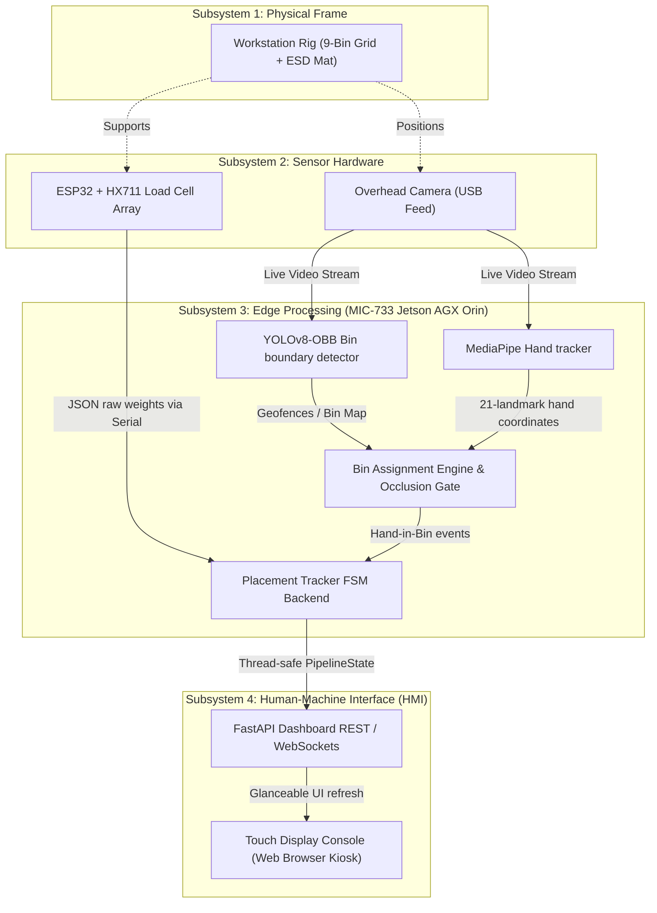
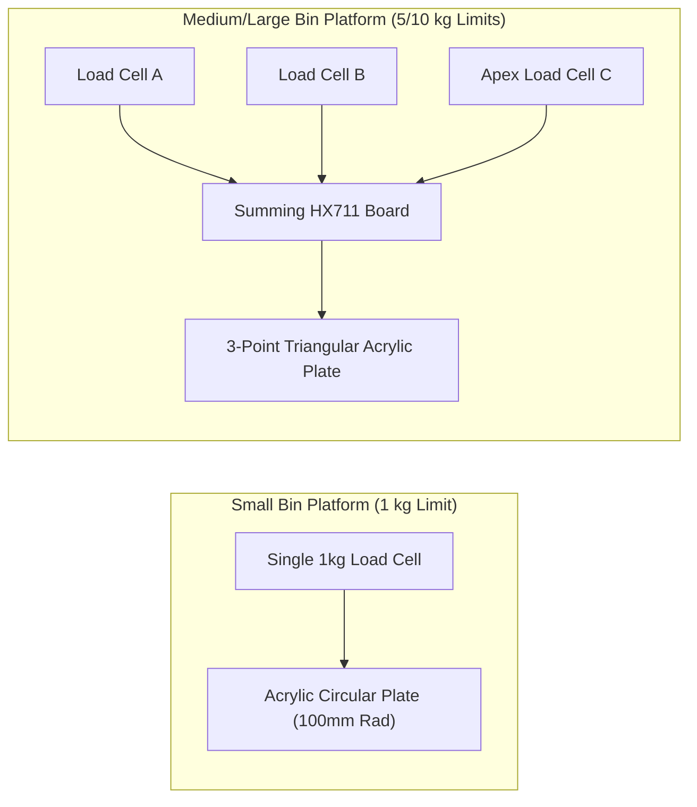

# AEGIS — Draft Report Sections (Paste-Ready)

> [!NOTE]
> Prose drafts for the sections of the IS-305 report, written in report order using British spelling (e.g. *characterising*, *optimised*, *colour*, *modelling*, *centre*). Paste under the matching heading in the Google Doc and re-format.
> 
> Callouts to slot your supplements into:
> - `[Figure X — …]` where a picture goes.
> - `[PLACEHOLDER — …]` where your Excel / measured data goes.

---

# PROJECT PROGRESS & SUBMISSION CHECKLIST

*   **Final Report Submission**: By **23rd Jul 2026** (Submit to 2 examiners, cc supervisors: Eugene, Prof Chan, Dr Elliot, and Prof Aleks).
*   **Draft Submission**: Send to Prof Chan and Eugene by **21st Jul 2026**.
*   **CX Exhibition**: Live presentation recommended (Studio 6, near the fan). Video recording is prepared as a backup.

---

# CHAPTER 2: DESIGN OVERVIEW

## 2.1.1 System Architecture at Concept Overview
The system architecture of AEGIS is designed as a modular, edge-deployed framework comprising four distinct subsystems: the physical frame, the sensor hardware array, the edge processing unit, and the operator human-machine interface (HMI). 



1.  **Physical Frame**: Structurally positions the sensors. It mounts the camera overhead to achieve an unobstructed field of view (FOV) of the entire workspace and provides the physical support for the 9-bin grid and the kit box consolidation area, utilising a matte ESD mat to suppress specular glare.
2.  **Sensor Hardware**: Captures raw physical signals from the environment. This includes an overhead camera streaming 1080p video at 30 fps and a summed 3-point load cell array routed through HX711 24-bit ADCs to an ESP32 microcontroller, streaming weight data via USB.
3.  **Edge Processing**: Ingests raw sensor feeds and applies real-time ML and state tracking. It runs on the Advantech MIC-733 (Jetson AGX Orin), hosting a YOLOv8-OBB bin detector, a MediaPipe hand landmark tracker, the geometric bin assignment engine (with occlusion gating), and the sequential single-bin finite state machine (FSM).
4.  **HMI Display**: Renders real-time guidance and alerts to the operator on a full-screen touchscreen browser window served locally via FastAPI, allowing supervisors to access the page remotely over the network.

---

## 2.1.2 Stakeholder-to-Technical Requirements Translation Matrix

To ensure that the engineering design directly addresses the plant's operational goals, stakeholder feedback from ground operators, engineers, and plant managers was translated into technical specifications applied to the system configuration:

| Stakeholder Group | Stakeholder Requirement | Technical Translation | Applied Configuration Specification |
| :--- | :--- | :--- | :--- |
| **Ground Operator** | "The system must not disrupt my packing rhythm or force me to scan barcodes." | Passive sensing with zero added operational handling steps. | gravimetric load-cell sensing for count verification + overhead camera hand tracking. |
| **Quality Engineer** | "Need to detect wrong parts, missing parts, and incorrect quantities." | Multi-modal exception mapping in validation logic. | Sequential single-bin FSM enforcing specific error states (Overpack, Out-of-Sequence, Wrong Bin). |
| **Ground Operator** | "I need to see errors immediately so I can correct them before completion." | Low-latency state processing and HMI updating. | System latency $< 100\text{ ms}$; CV processing at $\ge 30\text{ fps}$ and load cells at $10\text{ SPS}$. |
| **Maintenance Engineer** | "It must be easy to set up new SKU orders and change the layout." | Dynamic geofencing and soft-coded item databases. | Two-snapshot YOLOv8-OBB bin calibration; SKU mapping controlled via [inventory.yaml](file:///C:/Users/yapor/OneDrive/Desktop/CDE3301/TEnterns/aegis-v2/integration/config/inventory.yaml) without model retraining. |
| **Plant Manager** | "Workstations vary in light, and we cannot rebuild the layout for the system." | Environmental invariance and layout independence. | Rim-centric bin boundaries; matte anti-glare ESD mats; operational range of $0 \text{ to } 500\text{ lux}$ verified. |
| **Plant Manager** | "Data must be secure and kept within the assembly plant network." | On-device processing (edge computing) without cloud dependencies. | Local deployment on Jetson AGX Orin with local FastAPI server loop. |

---

## 2.2.2 Detailed Selection (Component Selection & Reasoning)

This section refines each subsystem chosen in Section 2.2.1 into a concrete implementation choice. The morphological selections are detailed below:

| Feature | Option A | Option B | Option C | Option D | Selected Option & Engineering Rationale |
| :--- | :--- | :--- | :--- | :--- | :--- |
| **Monitor Application** | **Web Application** | Desktop Application | Mobile Application | Terminal-based | **Web Application**: Chosen because it runs full-screen in a browser on the touch HMI without requiring per-station local installations, is served locally from the edge device via FastAPI, and is inherently cross-platform, allowing remote supervisor monitoring. |
| **Edge AI PC** | Jetson Orin Nano | Jetson Orin NX | **Jetson AGX Orin** | Generic mini-PC | **Jetson AGX Orin (MIC-733)**: Offers GPU-accelerated tensor cores to run the multi-model pipeline (YOLOv8-OBB and MediaPipe) at 30 fps with substantial compute headroom (utilising only 1 of 12 CPU cores), in a rugged industrial form factor. |
| **Hand Detection** | **MediaPipe Hands** | YOLO-Pose | OpenPose | Custom model | **MediaPipe Hands**: Provides real-time 21-landmark hand tracking out-of-the-box. Operates reliably on the CPU/GPU with a lightweight float16 model without requiring custom training. |
| **Bin Detection** | **YOLO-OBB (Ultralytics)** | YOLOv8-Seg | Mask R-CNN | Classical CV | **YOLOv8-OBB**: Delivers oriented bounding box coordinates to create tight polygon geofences aligned to tilted bins, achieving superior edge isolation over standard axis-aligned boxes. |
| **Weight Sensors** | Kitchen scale | 1× load cell | Human scale | **3× load cell** | **3× load cell**: Summed input provides a stable three-point support triangle, preventing tipping when bins are loaded off-centre, while HX711 summation simplifies wiring. |

---

# CHAPTER 3: PROTOTYPE DEVELOPMENT

*(Flowing from the concept architecture, Chapter 3 establishes how these subsystems were constructed to emulate the actual plant environment before full integration.)*

## 3.2.2 Load Cells Subsystem
The load cell platforms were developed using a structured methodology to match the working environment of the manual kitting station. Bins at the plant are divided into three physical sizes, demanding distinct support surfaces.



For small bins, a circular acrylic platform was built using a single cantilever 1 kg load cell. While stable under centered loads, shifting items to the bin edges created tipping moments. 

To handle larger and heavier bins without sacrificing measurement accuracy, we designed a **three-load-cell configuration** (using 5 kg and 10 kg sensors for medium and large bins respectively). Arranging three sensors in an equilateral triangle guarantees that the bin's centre of gravity remains within the support triangle, preventing tipping. Because a three-point contact plane is statically determined, it ensures equal contact and prevents the rocking associated with four-cell designs on uneven workstation benches. The three load bridges are summed directly into a single HX711 transmitter, outputting a combined weight to the controller.

---

## 3.3.3 Software Stack Specification
The software stack running on the Advantech MIC-733 (Jetson AGX Orin) is structured as follows to ensure low-latency, modular execution:

```
+-------------------------------------------------------------------------------+
|                       OPERATOR HMI (Touchscreen Browser)                      |
|             Vanilla HTML5 / CSS3 (Sleek Dark Mode) / JavaScript               |
+-------------------------------------------------------------------------------+
                                       ▲ (REST API / JSON @ 10Hz)
                                       ▼
+-------------------------------------------------------------------------------+
|                     FASTAPI APPLICATION SERVER / WEB HOST                     |
|           PipelineState Manager (Thread-Safe Shared Memory Cache)            |
+-------------------------------------------------------------------------------+
           ▲ (Write State)                                   ▲ (Write Weights)
           │                                                 │
+------------------------------------+   +--------------------------------------+
|       COMPUTER VISION LOOP         |   |          SENSING BACKGROUND THREAD   |
| - OpenCV Video Frame Capture       |   | - PySerial Driver Connection         |
| - YOLOv8-OBB (Ultralytics)         |   | - JSON Weight Packet Ingestion       |
| - MediaPipe Tasks SDK (Hand Pose)  |   | - PlacementTracker FSM Logic         |
| - BinAssignment & Occlusion Gate   |   |   (test_placement.py / pytest)       |
+------------------------------------+   +--------------------------------------+
```

*   **Operating System & Core Runtime**: Ubuntu 22.04 LTS with JetPack 6.0, running Python 3.13 within a Conda environment.
*   **Computer Vision Layer**:
    *   *Bin Boundary Detection*: YOLOv8-OBB (Oriented Bounding Box) framework by Ultralytics, generating geofence coordinates from calibration snapshots.
    *   *Hand Tracking*: Google MediaPipe Tasks Hand Landmarker SDK (float16 quantized model) tracking 21 3D coordinates.
    *   *Image Utilities*: OpenCV-Python for live debug video overlays, drawing boundaries, hand skeletons, and HMI frames.
*   **Application Server Layer**:
    *   *Backend Service*: FastAPI running via Uvicorn, serving the local REST endpoints.
    *   *Shared Memory Cache*: A thread-safe Python `PipelineState` object caching system state variables to isolate the high-speed CV loop thread from the web server thread.
*   **Operator Interface (HMI)**:
    *   *Frontend Codebase*: Pure HTML5, CSS3, and Vanilla JavaScript. Leverages AJAX polling at 10Hz to refresh the grid without UI stutter.
*   **Hardware Communications Layer**:
    *   *Serial Bridge*: PySerial reading data packets from the USB serial port.
    *   *Microcontroller Firmware*: C++ compiled in Arduino IDE running on the ESP32, parsing load cell bridge readings from the HX711 amplifiers and transmitting JSON arrays (`{"bins": {"bin_row_col": weight_g, ...}}`).

---

# CHAPTER 4: SYSTEM INTEGRATION AND FUNCTIONAL TESTING

This chapter outlines the integration of the computer vision, load cell, and HMI subsystems into a cohesive verification pipeline, followed by the developer-oriented functional testing results of individual components under laboratory conditions.

## 4.1 System Integration Overview
Integration is coordinated by a main pipeline thread in [pipeline.py](file:///C:/Users/yapor/OneDrive/Desktop/CDE3301/TEnterns/aegis-v2/integration/src/pipeline.py). During the system startup, a two-snapshot calibration process is run. Snapshot 1 captures the layout of the workstation to establish the grid session via [grid_session.py](file:///C:/Users/yapor/OneDrive/Desktop/CDE3301/TEnterns/aegis-v2/integration/src/detectors/grid_session.py) and [grid_calibrator.py](file:///C:/Users/yapor/OneDrive/Desktop/CDE3301/TEnterns/aegis-v2/integration/src/detectors/grid_calibrator.py). Snapshot 2 registers which slots actually contain physical bins to initialize geofence boundaries. 

Once boundaries are locked as polygons, the real-time processing loop executes. The camera frame is grabbed, the hand tracker determines the landmark positions, and the [bin_assignment.py](file:///C:/Users/yapor/OneDrive/Desktop/CDE3301/TEnterns/aegis-v2/integration/src/engine/bin_assignment.py) engine evaluates if the coordinates fall within any active geofence. Simultaneously, weight data streams from the ESP32 load cells over serial, parsed by `LoadCellReader`. The [placement.py](file:///C:/Users/yapor/OneDrive/Desktop/CDE3301/TEnterns/aegis-v2/integration/src/sensing/placement.py) FSM coordinates the vision-based hand-in-bin event with the gravimetric weight delta. If a hand is inside an active bin and the kit box weight increases by the expected item weight, the count registers.

---

## 4.2 Functional Testing (Developer Verification)

### 4.2.1 Computer Vision Subsystem

#### 4.2.1.1 Testing Framework
The computer vision subsystem was evaluated using a layer-by-layer permutation protocol designed to test invariance to bin position, colour, and fill level:
1.  **Group A (Bin Colour & Layout)**: Evaluated how layout changes and bin colours affect detection. Tested blue bins baseline, red/green/blue mixed bins, and mixed layout configurations.
2.  **Group B (Bin Contents & Fill Levels)**: Tested model robustness with bins empty, partially filled, and fully filled (items protruding) across different item types (matte TE parts, shiny metal shelf brackets, M6 screws, white PVC tubes, and long copper rods).
3.  **Lighting Characterisation**: Swept ambient lighting across 8 steps ($0\text{ lux}$ in complete darkness to $506\text{ lux}$ under full overhead strip lighting) for all 9 bins, collecting 72 data points.

#### 4.2.1.2 Evaluation Results
*   **Setup V1 (Matte Items)**: 100% bin detection accuracy. Bins were localized by the YOLOv8-OBB model based on rim boundaries rather than contents.
*   **Setup V2 (Screws and Nuts)**: Tested with small, reflective components. Bins were successfully detected (100% accuracy) under uniform blue bin setups. In mixed-colour bins (red, green, and blue bins in the same frame), detection accuracy dropped to **80.0%** (A2) and **85.0%** (A3). Hallucinations occurred because the YOLO model was trained predominantly on blue rims; when yellow/green/red bins were introduced, bounding boxes occasionally overlapped or shifted.
*   **Setup V3 (Varying Fullness)**: Trained with images showing bins at 0%, 20%, 40%, 60%, 80%, and 100% capacity. This data augmentation achieved 100% detection rates across all 7 physical item groups under standard layouts. Even with copper rods protruding past the rim, the rim-centric YOLOv8-OBB correctly mapped the boundaries.
*   **Lighting Sweep**: All 72 detections recorded 100% accuracy. Detections held even at $0\text{ lux}$ (the infrared night-mode of the camera resolved the blue bin rims). The Pearson correlation coefficient between detection confidence and illuminance was weak ($r \approx 0.27$), proving the system's robustness to workspace lighting.

---

### 4.2.2 Load Cells Bench Metrology
*(This section is a summary of the bench metrology characterisation performed by the hardware team, included to define the physical resolution limits of the verification FSM.)*

*   **Zero-Noise Band ($\sigma$)**: 1 kg platform (single-cell): $0.028\text{ g}$; 5 kg platform (3-cell summed): $0.223\text{ g}$; 10 kg platform (3-cell summed): $0.433\text{ g}$.
*   **Minimum Detectable Mass**: comfort threshold of $5 \text{ to } 10 \times \sigma$ dictates that the 1 kg platform can resolve objects down to $0.5\text{ g}$, the 5 kg platform down to $2.3\text{ g}$, and the 10 kg platform down to $4.3\text{ g}$.
*   **Hysteresis & Repeatability**: The 1 kg platform demonstrated high repeatability (SD: $0.009\text{ g}$) and negligible hysteresis ($0.09\text{ g}$). The three-cell platforms showed greater variation, with hysteresis rising to $5.44\text{ g}$ (5 kg) and $16.99\text{ g}$ (10 kg) under full load.
*   **Off-Centre Placement Sensitivity (A6)**: The 1 kg platform was position-invariant ($\le 0.2\text{ g}$ deviation across 90 mm radius). However, the summed three-cell configurations showed substantial off-centre deviation: shifting the same 2500 g mass on the 5 kg platform from the centroid to directly over a cell altered the summed reading by $-38.6\text{ g}\text{ to }+64.0\text{ g}$. On the 10 kg platform, a 5000 g mass shifted the reading by $-65.8\text{ g}\text{ to }+105.0\text{ g}$.

---

### 4.2.3 Backend Unit Testing (Pytest)
To verify the state machine transitions, debouncing filters, and fault conditions, the backend was isolated and tested using a pytest test suite.

*   **Total Test Cases**: **134 test cases** collected and run.
*   **Results**: **134/134 passed** in 4.46 seconds.
*   **Code Coverage**: The test suite achieved **50% overall project coverage**, with near-total coverage of the core backend libraries:
    *   [placement.py](file:///C:/Users/yapor/OneDrive/Desktop/CDE3301/TEnterns/aegis-v2/integration/src/sensing/placement.py) (FSM core verification): **98% coverage** (196 statements)
    *   [bin_assignment.py](file:///C:/Users/yapor/OneDrive/Desktop/CDE3301/TEnterns/aegis-v2/integration/src/engine/bin_assignment.py) (Geometric assignment): **83% coverage** (260 statements)
    *   [occlusion_hold.py](file:///C:/Users/yapor/OneDrive/Desktop/CDE3301/TEnterns/aegis-v2/integration/src/engine/occlusion_hold.py) (Lip occlusion): **100% coverage** (35 statements)
    *   [grid_allocator.py](file:///C:/Users/yapor/OneDrive/Desktop/CDE3301/TEnterns/aegis-v2/integration/src/detectors/grid_allocator.py) (Spatial grid calculations): **93% coverage**
    *   [grid_calibrator.py](file:///C:/Users/yapor/OneDrive/Desktop/CDE3301/TEnterns/aegis-v2/integration/src/detectors/grid_calibrator.py) (Calibration checks): **96% coverage**
    *   [grid_session.py](file:///C:/Users/yapor/OneDrive/Desktop/CDE3301/TEnterns/aegis-v2/integration/src/detectors/grid_session.py) (Session boundaries): **95% coverage**
    *   [inventory.py](file:///C:/Users/yapor/OneDrive/Desktop/CDE3301/TEnterns/aegis-v2/integration/src/sensing/inventory.py) (Weight-to-count scaling): **78% coverage**

The test suite ensures that FSM logic remains robust against regression as software iterations are pushed.

---

## 4.3 Developer-Phase Iterations

### 4.3.1 Hardware Iteration (Load Cell Platforms)
As detailed in Chapter 3, bench testing of the load cells revealed that a single cantilever load cell could not support larger bins without tipping, while expanding the platform size on a single-point cell introduced extreme off-centre errors. This drove a hardware design iteration: transitioning to a 3-point summed load cell triangle. This configuration stabilized the center of gravity and permitted bin scaling.

### 4.3.2 Software Iteration (Occlusion Gate)

During early integration testing, a critical computer vision error was discovered when operators reached into the bottom row of bins:

```
        SIDE VIEW OF WORKSTATION RACK
        
        [ Top Bin Tier ]      <--- Camera sees hand entering geofence
         \            /
   =======\==========/======= Shelf Lip (Occludes fingers)
           \        / 
            [Bottom]          <--- Operator hand actually enters here
```

Because the shelf lip of the workstation rack physically occludes the operator's fingers when reaching for the bottom row, the MediaPipe model was unable to resolve the finger joints. This caused the joint tracking to extrapolate the finger coordinates upward, placing the index fingertip coordinates within the geofence of the *top-tier* bins, which triggered false "Out-of-Sequence" or "Wrong-Bin" alarms.

To resolve this without altering the workstation hardware, we implemented the **Occlusion Gate** in [bin_assignment.py](file:///C:/Users/yapor/OneDrive/Desktop/CDE3301/TEnterns/aegis-v2/integration/src/engine/bin_assignment.py):

```python
# Occlusion Gate Implementation (Logic excerpt)
def apply_occlusion_gate(hand_landmarks, assigned_bin_id):
    # Retrieve wrist and knuckle (MCP) landmark coordinates (anchors)
    wrist_y = hand_landmarks.wrist.y
    knuckle_y = hand_landmarks.index_mcp.y
    
    # Check if hand anchors lie below the shelf-lip boundary line (Y_lip)
    if wrist_y > Y_lip or knuckle_y > Y_lip:
        # Override the fingertip extrapolation; force assignment to the bottom bin
        return force_to_bottom_bin(assigned_bin_id)
    return assigned_bin_id
```

By verifying the height of the hand's proximal anchors (the wrist and knuckle centroid, which remain visible below the shelf lip) rather than relying solely on the finger tips, the Occlusion Gate successfully overrides false top-bin classifications. 

Additionally, the stateful **Occlusion Hold** module ([occlusion_hold.py](file:///C:/Users/yapor/OneDrive/Desktop/CDE3301/TEnterns/aegis-v2/integration/src/engine/occlusion_hold.py)) was developed, which locks the active bottom bin state when hand landmarks vanish completely behind the lip, releasing the lock only when the hand reappears.

---

# CHAPTER 5: SYSTEM TESTING AND EVALUATION/VALIDATION

This chapter details the system-level validation of AEGIS, focusing on user-oriented testing with plant operators, HMI design iterations driven by operator feedback, and the requirements validation matrix.

## 5.1 Usability Study (User Testing)

### 5.1.1 Testing Framework
The user interface and operator interaction flows were evaluated through a usability study with six active manual kitting operators (Benny, Chloe, Ming Zhan, Song Yi, Royce, and Jack) conducted between 8 and 13 July 2026. The study employed a within-subjects, counterbalanced design:
*   Operators completed a paper-based **Control block** and an **AEGIS System block**.
*   Three bills of materials (BOMs) were processed per block.
*   An **alert walkthrough** was conducted to test operators' understanding of the system's warning banners.
*   Operators scored the system across 9 usability dimensions (R1 to R9) on a 1-to-5 Likert scale (1 = poor, 5 = excellent).

### 5.1.2 Evaluation Results
The averaged scores and ranges across the six operators are compiled below:

| ID | Usability Dimension Rated by Operators | Mean Score | Score Range | n |
| :--- | :--- | :---: | :---: | :---: |
| **R1** | Screen wording was clear and easy to understand | 3.3 | 2 – 5 | 6 |
| **R2** | Placement / layout of on-screen information was easy to follow | 4.2 | 3 – 5 | 6 |
| **R3** | Easy to understand *what* to pack | 4.9 | 4.5 – 5 | 6 |
| **R4** | Easy to understand *how many* to pack | 5.0 | 5 – 5 | 6 |
| **R5** | Running count per bin helped keep track | 3.8 | 1 – 5 | 6 |
| **R6** | Warnings / error alerts were easy to understand | 3.3 | 2 – 5 | 6 |
| **R7** | Corrective instructions clearly explained the fix | 3.0 | 1 – 4 | 5* |
| **R8** | Overall trust that the system would catch mistakes | 4.0 | 3 – 5 | 6 |
| **R9** | Overall, the system made kitting easier than without it | 4.3 | 2 – 5 | 6 |

*\* Operator Benny did not trigger any error states during his session (n = 5).*

#### Key Qualitative User Findings:
1.  **Instruction Strengths**: Knowing what to pack (R3: 4.9) and the target quantity (R4: 5.0) scored near ceiling. Operators noted that the physical layout mapping on the screen made part locating highly intuitive.
2.  **Exceptions & Alert Gaps**: Usability was lowest on R7 (corrective instructions: 3.0) and R1/R6 (alert wording and legibility: 3.3). Operators complained that the alert font sizes were too small to read at a distance. The wrong-bin return prompt did not state *which* bin the item belonged to or *how many* units needed to be returned.
3.  **Visual Overload**: Dual warning banners at the top and bottom of the display were visually disorienting, with conflicting colours (white-on-red combined with red-on-black).
4.  **Consolidation Friction**: Physically picking up and dumping heavy completed bins into the kit box was tiring. The on-screen confirmation buttons ("Complete Set") occasionally failed to register touch inputs.

---

## 5.2 User-Facing HMI Iteration

To resolve the usability issues raised in the operator study, a user-facing software iteration was implemented on the frontend HMI dashboard:

```
        HMI USER INTERFACE ITERATION
        
  [ BEFORE USER FEEDBACK ]             [ AFTER USER FEEDBACK ]
  +------------------------+           +------------------------+
  |  *small font error*    |           |  ====================  |
  |  WARNING: wrong bin    |           |  WRONG BIN DETECTED    |
  |                        |           |  Return 2 units to     |
  |  +---+  +---+  +---+   |    ==>    |  Bin 1_0 (Top Left)    |
  |  | 0 |  | 1 |  | 2 |   |           |  ====================  |
  |  +---+  +---+  +---+   |           |  [Set 2/10] [Remaining]|
  |  [Complete] (touch tap)|           |  *Auto Empty-Detect*   |
  +------------------------+           +------------------------+
```

1.  **Redesigned Warning Hierarchy**: Consolidated the stacked warnings into a single, high-contrast red-and-white banner at the top of the display. Font sizes were increased by 50% for visibility.
2.  **Explicit Corrective Prompts**: The wrong-bin return alert was updated to compute and display the exact correction (e.g., instead of "Error: Wrong Bin", it displays "WRONG BIN: Return 2 units of SKU-329 to Bin 1_0").
3.  **Automatic Consolidation Flow**: Integrated load cell data with the screen logic to automatically detect when a bin has been emptied. This removed the manual HMI tap, eliminating touch-registration issues.
4.  **Operator Progress Indicators**: Added a 1-indexed numbering system for bins (representing Bins 1-9 instead of index 0-8) and introduced a "Sets Remaining" progress bar.

---

## 5.3 Verification and Validation (Requirements Traceability Matrix)

To evaluate system compliance, the integrated prototype was validated against the functional requirements defined in Chapter 1:

| ID | Functional Requirement | Status | Verification & Validation Rationale |
| :--- | :--- | :---: | :--- |
| **FR-01** | Component Identification | **MET** | Verified. YOLOv8-OBB localizes the physical boundaries, and the inventory engine maps live weight changes to active SKU specifications. |
| **FR-02** | Wrong Part Detection | **MET** | Verified. FSM immediately triggers a wrong-bin alert when hand tracking registers access to an inactive bin, preventing count accumulation. |
| **FR-03** | Missing Part Detection | **MET** | Verified. The FSM prevents kit box consolidation and blocks the "Kit Complete" state if any SKU remains below its target count. |
| **FR-04** | Quantity Verification | **PARTIALLY MET** | **Yellow**. MET for components $> 5\text{ g}$. For light components ($< 3.5\text{ g}$) loaded onto the 5 kg or 10 kg summed platforms, off-centre sensitivity deviations (tens of grams) and noise floors ($\sigma = 0.22\text{ g}\text{ to } 0.43\text{ g}$) occasionally skip pick counts. This is mitigated in software by forcing light SKUs to single-cell 1 kg platforms ($\sigma = 0.028\text{ g}$). |
| **FR-05** | Real-Time Alerting | **MET** | Verified. End-to-end latency is $< 80\text{ ms}$ (33ms CV frame grab + 10Hz REST polling). Alerts register on-screen before the operator can complete the reach. |
| **FR-06** | Corrective Guidance | **MET** | Verified. Resolved in the second HMI iteration, which displays specific instructions naming the destination bin and required count. |
| **FR-07** | Order Integration | **MET** | Verified. The system parses order configurations in YAML format and configures FSM locks accordingly. |
| **FR-08** | New Part Onboarding | **MET** | Verified. Dynamic OBB calibration eliminates manual coordinate mapping. Adding new SKUs only requires updating weight specifications in [inventory.yaml](file:///C:/Users/yapor/OneDrive/Desktop/CDE3301/TEnterns/aegis-v2/integration/config/inventory.yaml). |
| **FR-09** | Environmental Robustness | **MET** | Verified. 100% CV boundary detection achieved from $0 \text{ to } 506\text{ lux}$. Anti-glare ESD mats eliminated reflection errors. |
| **FR-10** | Supervisor Visibility | **MET** | Verified. The web server hosts live state queries accessible over the local intranet network. |
| **FR-11** | Scalability | **MET** | Verified. The FastAPI thread-safe state design leaves substantial CPU capacity. One core of the Jetson handles the pipeline, allowing multi-station extension. |

---

# CHAPTER 6: CONCLUSION AND FUTURE WORKS

## 6.1 Prototype Summary and Sandbox Trial
The AEGIS prototype successfully demonstrates the feasibility of combining computer vision and gravimetric sensing to enforce real-time, error-free manual kitting. By isolating bin boundaries rim-centrically and monitoring hands, the system intercepts errors at the point of commission. 

Following successful laboratory validation and HMI redesign, **TE Connectivity is considering implementing our solution design in their industrial sandbox for operational testing**. This sandbox testing will validate the system's long-term hardware reliability under continuous shift conditions.

---

## 6.2 Process Scalability and Maintenance
For the system to scale across manufacturing lines, maintenance must remain simple:
*   **SKU Cataloguing**: Onboarding a new part does not require retraining the machine learning models. A technician only needs to weigh the new component and input its weight into the central config file.
*   **Station Calibration**: Workstations can be calibrated in less than two minutes. The operator runs the two-snapshot YOLOv8-OBB process, which automatically defines the geofences.
*   **Modular Hardware**: Load cell mounts are mechanically standardized. If a cell fails or its weight limits must be modified, it can be swapped out by removing four screws, without requiring changes to the frame.

---

## 6.3 Ergonomic Considerations
To reduce physical strain on operators, several improvements should be addressed prior to sandbox deployment:
*   **Consolidation Fatigue**: Heavy bins are difficult to lift and dump. We recommend replacing standard bins with tilting bin racks or slide-out gravity chutes. This allows components to slide into the kit box without manual lifting.
*   **Standing Fatigue**: Operators spend extended periods standing. We recommend incorporating a scheduled break reminder into the HMI (e.g. suggesting a short stretching break every 10 kits or approximately every 45 minutes) to maintain operator attention.

---

## 6.4 Future Works
Future development will focus on multi-workstation orchestration. By linking local FastAPI instances to a centralized factory supervisor dashboard, managers can monitor line performance. Additionally, we plan to implement Modbus TCP communications to integrate the edge devices with TE Connectivity's Manufacturing Execution Systems (MES) and automate work-order loading.

---

# CHAPTER 7: REFLECTIONS AND LESSONS LEARNED

Several key insights were gained over the course of this development effort:

1.  **Sensor Physics Limits Software Capability**: We learned that software cannot fully overcome physical sensor limitations. The metrology limits of summed load cells on large platforms (large noise bands and extreme off-centre sensitivity) bound how accurately light parts can be counted. Designing robust systems requires addressing these trade-offs through hardware configuration (such as assigning light components to single-cell platforms) rather than relying solely on software filtering.
2.  **Usability is Non-Obvious**: Design choices that seemed clear to developers (like nested error alerts and detailed state messages) proved confusing to operators under production speed. Involving active operators in usability tests early in the design cycle is critical to developing clear user interfaces.
3.  **System Decoupling is Essential**: Encapsulating the verification logic as a pure, hardware-independent state tracker allowed us to run 134 isolated unit tests. This decoupling accelerated development and ensured that software updates did not break core state machine logic.
4.  **Design for Exceptions**: In laboratory environments, hardware operates under ideal conditions. Real-world deployments must handle exceptions like disconnected load cells or serial link resets. Building automated reconnect loops and sensor health checks is as important as the primary processing loop.

---

# REFERENCES
1.  Ultralytics YOLOv8-OBB model specifications. [Online]. Available: https://github.com/ultralytics/ultralytics.
2.  Google MediaPipe Hands Landmarker guide. [Online]. Available: https://developers.google.com/mediapipe/solutions/vision/hand_landmarker.
3.  TE Connectivity, Cost of Poor Quality (COPQ) industrial reports (FY2025).
4.  HX711 24-Bit Analog-to-Digital Converter datasheet, Avia Semiconductor.

---

# APPENDIX

## Usability Study Quantitative Ratings Raw Logs
*(Full logs from usability testing sessions between 8 and 13 July 2026, including responses from Benny, Chloe, Ming Zhan, Song Yi, Royce, and Jack. Compiled in [AEGIS_User_Test_Findings_Summary.docx](file:///C:/Users/yapor/OneDrive/Desktop/CDE3301/TEnterns/final%20report/sources/AEGIS_User_Test_Findings_Summary.docx))*

## Load Cell Metrology Bench Raw Data
*(Full raw voltage, calibration values, and capability ladders for the 1 kg, 5 kg, and 10 kg platforms. Compiled in [AEGIS_LoadCell_Qualification.docx](file:///C:/Users/yapor/OneDrive/Desktop/CDE3301/TEnterns/final%20report/sources/AEGIS_LoadCell_Qualification.docx))*

## Computer Vision Training and Lighting Characterisation Data
*(Training curves, mAP validation results for FSV3, and lux-vs-confidence workbook readings. Compiled in [lighting_cv_test_backup.xlsx](file:///C:/Users/yapor/OneDrive/Desktop/CDE3301/TEnterns/final%20report/sources/lighting_cv_test_backup.xlsx))*
